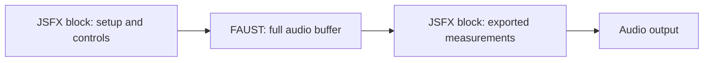

# DSP-JSFX: consolidated user and author guide

Current local implementation, 6 October 2026. This is the entry point for the repository's additions to ordinary JSFX. Detailed API contracts and qualification reports remain linked for reference; older experiment reports are not the specification.

## What you get

DSP-JSFX compiles JSFX/EEL2 into native VST3 and CLAP plugins through LLVM and JUCE. It adds embedded FAUST DSP, structured background tasks, sample banks, inter-instance messages, text controls, native graphics options, and host sleep policies. These extensions require this toolchain: stock REAPER JSFX cannot execute `@faust`, `defer`, or the added host APIs.

For a musician, install the built CLAP/VST3 and use it normally. No FAUST installation or background compiler is needed on the playback machine. Each plugin's `?` panel contains its own README. UI parameter changes use the host automation bridge, including the repaired CLAP last-touched notification path. Rebuild existing binaries to receive runtime fixes.

For an author, ordinary JSFX remains the starting point. Add only the extension your workload needs:

| Need | Facility | Execution |
| --- | --- | --- |
| Stateful audio filters or a signal graph | `@faust block` | Synchronously on the host processing thread |
| Long analysis independent of current audio | `defer` task graph | Two task workers per instance |
| Large immutable recordings | `sample_pool_*` | Worker loading, realtime reads |
| Coordination between plugin instances | `msg_*`, named `gmem` | Block-resolved messages / shared cells |
| Compile an existing interactive canvas | Native Legacy `@gfx` | Graphics worker, live shared guest cells |
| Explicitly owned UI data | Native publication graphics | Graphics worker, bounded snapshots/commands |
| Stop processing when safe | Automatic or cooperative sleep | Host realtime policy |

Compilation alone does not establish perfect REAPER compatibility, audio deadlines, or a performance improvement.

## FAUST: the practical interface

Write legal FAUST source inside an `@faust` section. Imports, definitions, feedback and `process` use FAUST syntax. JSFX retains setup, parameters, policy, file handling and graphics.

```eel
desc:Mixed stereo gain
slider1:0.5<0,1,0.01>Gain

@init
meter = 0;

@block
level = slider1;

@faust block
import("stdfaust.lib");
meter = max(abs(spl0), abs(spl1));
process = spl0 * level, spl1 * level;

@block
last_level = meter;
```

Here `level` becomes a hidden FAUST control, `spl0`/`spl1` become audio input signals, and `process` supplies the output channels. Because `meter` was declared in JSFX, the matching parameterless FAUST definition exports its signal back to that scalar. The later `@block` sees its **final sample**, not its maximum over the buffer. Implement a real peak/average accumulator when that is wanted.



At build time, the FAUST LLVM backend produces a module that is linked with the JSFX LLVM module and emitted as native code. At playback time, each processor has private FAUST histories and prepared buffers. **FAUST is not a deferred task and does not run on task workers.** It computes as part of the host audio callback; there is no playback-time FAUST compilation or JIT.

### Bindings and ownership

- Existing JSFX scalars, slider aliases, `slider1`–`slider256`, `srate` and `samplesblock` can be inferred as controls. No visible sliders are added. Controls refresh before each compute call.
- `spl0`–`spl63` are signal inputs. Standard FAUST `_` inputs also work. `process` outputs map to audio channels in order.
- Matching top-level parameterless definitions export signals to existing JSFX globals. Ordinary FAUST-only names remain private. Namespaced scalars such as `params.gain` are supported through generated environments.
- FAUST-local definitions take precedence. Unknown external names fail compilation rather than silently reading zero. JSFX binding names are case-insensitive.
- JSFX RAM, `gmem`, strings and EEL functions are not implicitly available inside FAUST. Transfer selected values explicitly through scalar bindings or supported captured streams. FAUST feedback still requires legal FAUST delay/feedback syntax.
- Exporting a slider alias updates it through the notification bridge. The generated `__za_` namespace is reserved.

### Ordering and full buffers

In a mixed script, source order of repeated `@block`, `@sample` and `@faust` sections defines the processing timeline. Lifecycle sections such as `@init`, `@slider` and `@gfx` retain their roles. Scripts without FAUST keep the existing JSFX order.

| Form | Contract |
| --- | --- |
| `@faust` | Automatically batches independent stages; falls back to sample interleaving when scalar dependencies require it |
| `@faust block` | Requires block execution; rejects unresolved sample feedback instead of silently using `compute(1)` |
| `@faust block when enabled` | Block execution with a scalar gate; when disabled, passes audio through and freezes private history and exports |

**There is currently no `@faust sample` spelling.** Unqualified `@faust` supplies the dependency-preserving automatic path. Use explicit block mode when full-buffer execution is a requirement.

For `@faust block`, imports written by the nearest preceding `@sample`, including reachable helpers, can become private per-frame streams. The runtime captures those values after that sample stage, so a changing gain can remain sample-accurate while FAUST processes a buffer. Captured streams do not create host audio pins. Other imports are scalar controls. A later block assignment does not overwrite an already captured stream: use a separate name for a block control.

True same-sample scalar feedback, multiple potentially aliasing EEL sample sections, or dependent scalar exports can still require interleaving. An explicit `@block` boundary separates processing phases, but it is the author's responsibility to preserve reset, event and shared-memory semantics. A conditional gate must not be written by a sample stage. Re-enabling a stage resumes its frozen history; it does not automatically clear a tail.

Advanced: `options:za_faust_quantum=256` processes an unfused pipeline in chunks of up to 256 frames. The initial `@block` runs once per host callback; later stages and block hooks repeat per chunk. `samplesblock` remains the original host frame count. Keep MIDI ingestion and host clocks in the initial stage. The allowed quantum is 2–4096. This adds no pipeline latency, but changes the cadence of later hooks.

### Guarantees, limits and performance

The bridge prepares storage before processing and does not allocate, free, compile, JIT or acquire locks in its mixed processing function. This does not make arbitrary JSFX host calls or user foreign functions realtime-safe. FAUST's own delays retain their latency. Oversampling/rate reinitialization resets its state. Oversized buffers fail with a memory fault and silence rather than growing storage in the callback.

Current limits per section: 64 audio channels, 128 internal signal ports, 256 inferred imports, and a 256 MiB bound on private DSP state plus prepared table banks. Arithmetic is double precision with outer host-float conversion. Instances own their histories and generated tables. Table initialization cannot depend on live JSFX controls; unsupported backend layouts fail explicitly.

FAUST can improve an appropriate kernel, but bridge/control/export overhead and unchanged JSFX work determine whole-plugin gains. Benchmark the same algorithm in complete processors, inspect generated metadata for fused groups, compare output and transitions, and keep algorithm redesign claims separate from execution improvements. Original-design CMD measured **1.21–1.45×**, with worst tested sample difference below **3e-14**; the much larger CMD Flow numbers described a different algorithm.

See [FAUST contracts](JSFX-Faust-Sections.md) and [faithful CMD qualification](CMD-Original-FAUST-Integration.md).

## Background work: tasks rather than audio pacing

```eel
@init
job = 0;

@block
job == 0 ? (
  candidate = defer_reduce(i, 100, SUM, 0, i*i;);
  candidate > 0 ? job = candidate;
);
task_status(job) == TASK_SUCCEEDED ? (
  answer = task_result(job);
  task_release(job) == 1 ? job = -1;
);
```

The body runs later. Scalar globals, surrounding parameters and locals are captured by value; worker writes do not mutate the live plugin. Bodies return their last scalar expression. Coarse work from `@block` or compiled native `@gfx` is preferable to submissions per audio sample.

| Operation | Meaning |
| --- | --- |
| `defer(body)` | Submit a body; parent completion includes nested descendants |
| `defer_after(task, body)` | Run after successful dependency; capture occurs at submission |
| `defer_for(i, count, body)` | Independent iterations; read results with `task_value(handle, i)` |
| `defer_reduce(i, count, SUM, identity, body)` | Indexed reduction; also PRODUCT, MIN, MAX, ANY, ALL |
| `defer_all(a, b, ...)` | Completion join retaining its dependencies |
| `task_status`, `task_finished`, `task_result` | Nonwaiting status/result queries; check success before consuming |
| `task_cancel`, `task_release` | Request cooperative cancellation / release retained ownership |

Status values: INVALID −1, PENDING 1, RUNNING 2, SUCCEEDED 3, CANCELLED 4, FAILED 5. Finished includes failure and cancellation, not just success. Submission/mutation errors include capacity −1, busy −2, invalid argument −3 and unavailable dependency/buffer −4. Retry contention on a later callback; never spin on the audio thread. Cancellation is checked at entries and loop iterations and does not interrupt a builtin already executing.

Use `task_buffer_create/set/seal/read/release` for immutable multi-cell inputs. Initialize every cell before sealing. Ordinary deferred bodies cannot access live RAM, `gmem`, sliders, audio samples, graphics, strings, files, random state or host communication; reachable helpers are checked too. Capture slider values into ordinary scalars first.

Two workers per instance service a bounded scheduler: 32 task slots, 4096 iterations per parallel task, 64 captured function locals, 4096 scalar variables, eight buffers of up to 65536 doubles. Iterations are chunked in groups of 32; idle workers poll approximately every millisecond. There is no global worker budget or work stealing. Stage large graphs and release root handles. Handles are instance-local, transient and invalidated by reset; do not serialize them. Reduction combination is in index order, not worker completion order.

Successful results are published for polling without an audio-pacing delay. **Adoption still requires the host to call the plugin's coordinator.** Workers do not modify an active audio model automatically. Outstanding work/results veto sleep until acknowledged. There is no general offline preparation barrier or promised completion deadline.

### Large analyses and whole-model adoption

Private arenas let sequential `defer_arena(arena, dependency, body)` stages share private mutable RAM and captured configuration. This is how Corpus chains indexing, features, structure and PE without pacing every analysis step through audio callbacks.

`task_arena_create/copy_in/seal/copy_out/commit/release` provides bounded transfers. Copy calls cover at most 16384 cells; consumers must stay disabled until the final commit. Native Legacy additionally provides `task_arena_clone/preserve/adopt`: worker snapshot, serial analysis chain, then whole-heap ownership swap at the safe publication boundary. Inputs must be frozen during the snapshot and source/configuration epochs validated before adoption. Atomic cell access is not a coherent snapshot by itself.

One arena is bounded to 25,165,824 doubles (192 MiB), in addition to the live heap. Allocation/reclamation run on workers. Up to 16 preserved live ranges total 262144 cells (2 MiB); adoption still copies these ranges. Read-only sample access pins the requested immutable sample generation. Shared `gmem`, files, host/audio/GFX mutation and heap growth remain forbidden in arena bodies. Progress fields are approximate telemetry, not a transaction.

See [complete task and arena API](Structured-Tasks.md).

## Samples and file workflows

`file_mem()` remains the compatibility path into double-cell JSFX RAM. For a large bank use runtime-owned packed float32 samples:

```eel
@init
pool = sample_pool_from_slot(0, "main");
sample_pool_set_mode(pool, SAMPLE_MODE_RESIDENT);
sample_pool_set_budget_mb(pool, 4096);
sample_pool_commit(pool);

@block
ready = sample_pool_state(pool) == SAMPLE_POOL_READY;
id = sample_get(pool, 0);

@sample
ready ? sample_read2_interp(pool, id, phase, l, r);
```

Sample IDs are not heap pointers. The loader builds immutable generations; check ready/partial/failed state and generation before using them. Resident and budgeted modes are implemented; lazy/paged and streaming modes are reserved. Budgeted mode can skip samples. Queries expose selected/loaded/failed counts, RAM use, metadata and previews; interpolated mono/stereo reads serve playback. Explicit `sample_export_mem*` copies are expensive and block-only.

For coordinated replacement, `sample_pool_set_deferred(pool, 1)` holds a completed generation until `sample_pool_adopt(pool)` at the script's safe boundary. Treat sample-generation changes as model invalidation. Pool setup/services are not blanket allocation-free APIs. GFX should use mirrored metadata/previews; DSP pool calls are restricted to DSP sections rather than being general live GFX access.

The host file-slot UI supports direct loading, raw append/mega textures, segmentation, preprocessing, and segment-then-append. Recipe results stay in memory without temporary WAV files. Stored recipes replay from source paths/fingerprints; resident results can consume substantial RAM. These are host import workflows, not new FAUST syntax.

See [sample pool](DSP-JSFX-SamplePool.md) and [file recipes](FileImportRecipes.md).

## Inter-instance communication and text controls

```eel
slider1:#bus_name="main"<string>Bus Name

@init
comm_join(#bus_name);
msg_subscribe("ctl");
gmem_attach(#bus_name);

@block
msg_send("ctl", 1, 0.5, 0, 0, 0);
while (msg_recv("ctl", sender, tag, a, b, c, d)) (
  received = a;
);
```

A string slider is an instance-local saved text field, not an automatable numeric parameter. Its alias is an opaque string handle. Rejoin/reattach from `@slider` when a live bus edit should change domains.

`msg_send/sendto`, buffer variants, inbox queries, subscription/advertising and peer discovery provide block-resolved IPC. Sends from one block are enqueued at its end and visible when the receiver materializes its next inbox. FIFO holds per sender/channel; no global ordering across senders or same-sample feedback is promised. Check drop counters and bound receive work. Broadcast excludes self by default; discovery is advisory.

`instance_id/uid`, names and peer queries support routing. Named `gmem` supplies shared random-access cells, with block-only bulk get/put/fill/zero/copy. Shared cells do not automatically supply an atomic multi-cell protocol. Track-name queries (`track_name`, availability and sequence, with `host_track_*` aliases) depend on host-provided context; handle unavailable names.

See [communication APIs and section restrictions](DSP-JSFX-Communication.md).

## Graphics, compatibility and host behavior

There are three graphics paths. Existing EEL graphics remains available. Native Legacy compiles a broad existing canvas against the same live guest scalars and fixed heap as DSP. Native publication mode compiles a declared ownership contract: bounded snapshots for reads, graphics-owned state, and explicit commands/parameter edits. Publication mode requires source migration; it is not an automatic replacement for arbitrary GFX RAM access.

Legacy `options:maxmem=N` is in double cells; default 8,388,608 cells is 64 MiB per instance. Pages are allocated/touched at construction and the heap cannot grow. Guest loads/stores are relaxed atomic per cell, preventing data-race undefined behavior but **not** giving transactional frames/tables or atomic `x += 1`. Explicit `atomic_*` calls use a mutex and can block; mutable strings and some host services also have separate synchronization. Shared FFT operations gather/commit cells rather than forming atomic whole-buffer operations.

Legacy supports the catalog's drawing/input, offscreen images, text, menus, drops, strings and worker file paths, but is not complete REAPER parity. `gfx_idle/gfx_idle_only` are unsupported. Custom `@serialize` bodies are not executed; host parameter/file-path saving is not a substitute for custom sample/table serialization. Unchanged UI frames should not wake DSP. Slider authors must notify actual changed fields rather than indiscriminately touching every parameter.

Sources with `<? ... ?>` blocks are preprocessed through Cockos/WDL before import expansion; root `config:` defaults are compile-time values rather than runtime controls. See [compatibility and imports](Compatibility-and-Imports.md). The resolver expands imports once for DSP/GFX, searches deterministically within the package, records input hashes/section owners, and rejects ambiguous/missing/cyclic imports. Nested receiver namespace fixes and opt-in checked EEL assignment stores improve compatibility; neither establishes complete numerical/lifecycle parity. `jsfxCompatibility.eel2Stores` clears nonfinite/subnormal assignment results, while `gfxMemory` configuration controls the EEL graphics memory bridge.

See [Legacy contracts](Native-GFX-Legacy.md), [publication-mode example](Native-GFX-Publication.md), and [compatibility coverage](JoepVanlier-Native-Compatibility.md).

## Sleep: current policy

The host supports Default/Auto, Never sleep, Silence, Events and Free-running, selected through the sleep badge menu and saved with the project. Default/Auto chooses cooperative permission when a script declares `za_sleep_ready`; otherwise it uses its idle option/topology. Automatic silence sleep is a CPU-saving heuristic that freezes state below the configured output threshold after a hold interval. Use Never sleep for continuously evolving state or reference comparisons. Offline/non-realtime processing always advances DSP.

For a proven settled state, write `za_sleep_ready = 1` during the processed block. The host clears it before each block and requires a fresh exactly finite 1, exact-zero output, no input/event activity and no pending task obligation. Readiness means skipping preserves future behavior, not merely that input is quiet. Account for tails, envelopes, oscillators, internal clocks and scheduled work. `za_keep_awake` vetoes sleep.

Every nonzero input wakes DSP; parameters, MIDI, transport, file/data adoption and explicit wake events also wake it. Task results remain obligations until released; cancellation alone is not acknowledgment. Automatic realtime sleep can affect recovery/null comparisons, and entering offline mode cannot reconstruct state skipped previously. Compare fresh matched instances and sleep settings.

See [sleep contract](Cooperative-Sleep.md) and [Hyperreal idle/CLAP fix](Hyperreal-Panner.md).

## Build, validation and the current examples

```text
python scripts/build.py --list
python scripts/build.py --only "Cross-Mix Somatic Bus (CMD)" --config Release --tag dev --out dist
python scripts/build.py --only Sample --native-gfx-legacy --config Release
```

Each leaf has a `plugin.json`, source and embedded README. Manifests can select native graphics; JoepVanlier sources automatically select Legacy. Native Legacy and publication flags are mutually exclusive. Build-time dependencies include Python/llvmlite, CMake, a native compiler and initialized JUCE/CLAP dependencies; mixed sections also require a compatible FAUST LLVM compiler. `JSFX_FAUST_COMPILER` selects its executable; repeatable AOT `--faust-include` adds import paths, and normal builds include the source directory.

`--correctness-check` enables the WDL/EEL shadow path for eligible ordinary scripts. It is rejected for mixed FAUST, tasks and Legacy rather than pretending stock EEL can evaluate extensions. Their validation uses dedicated compiler/runtime fixtures and paired complete-processor tests. Foreign functions, all DAWs/platforms, every preset and universal bit-exact parity are not certified by those tests.

Current examples separate functionality from experiments:

- **CMD:** original algorithm, full-block FAUST; [numerical/performance report](CMD-Original-FAUST-Integration.md). CMD Flow is archived, not the default.
- **EasyExpander Faust:** mixed detector/gain example; use current matched sleep settings when benchmarking.
- **Sample Faust:** optional variant, retains character formulas and state handoffs with conservative EEL fallback; [whole-plugin results](Sample-Faust-Character-Integration.md). An isolated kernel gain does not describe the whole sampler.
- **Corpus:** arena task graph for analysis. Its FAUST experiments do not establish that conversion improves the maintained engine; [revised audit](FAUST-Qualification.md).
- **Hyperreal default:** faithful EEL Fast optimization, not a FAUST conversion; [promotion report](Hyperreal-Panner.md). Redesigned FAUST renderers are separate algorithm experiments.

Use this guide for the current platform interface, plugin READMEs for operation, and individual reports for measured evidence. Older reports retain historical configurations and should not override the current contracts.
