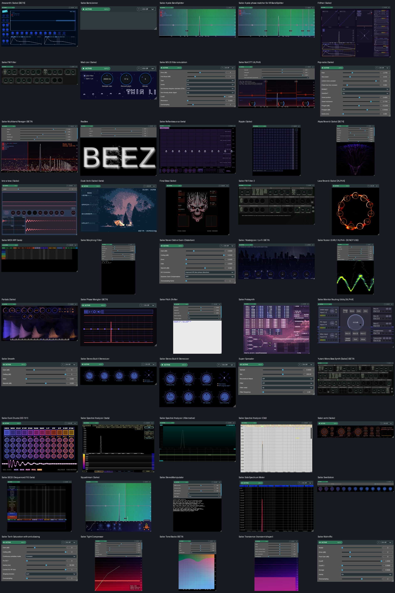

# JoepVanlier native result matrix

All 50 configured packages passed native generation, the WDL audio/short-MIDI comparison, and the production JUCE editor lifecycle check. All observed audio errors and MIDI differences were zero in this fixture. All DSP/GFX heap-fault checks were zero.

Tested compiler SHA-256: `711dce756144c4667cf6a06354b7614d95880d0d8998e4503f2d14f29d7c3278`. Base commit: `7b6c120c8f9042d22c8003c88efa61175934cf7a`.

This is a Linux native compatibility checkpoint. Read [the scope and remaining gaps](../JoepVanlier-Native-Compatibility.md), especially custom `@serialize` and wrapper/DAW qualification. The editor host uses one common identity. Native guest objects use LLVM `-O2`; the test host processor uses `-O0`. Timings in the JSON are fixture measurements, not a controlled WDL/native performance benchmark.

| Package | Native | Audio/MIDI | Outputs | Editor | Published frames | Heap MiB |
|---|---|---|---:|---|---:|---:|
| Amaranth (Saike) [BETA] | PASS | PASS | 2 | PASS | 37 | 64.0 |
| Saike BandJoiner | PASS | PASS | 2 | PASS | 0 | 64.0 |
| Saike 4-pole BandSplitter | PASS | PASS | 10 | PASS | 38 | 64.0 |
| Saike 4-pole phase matcher for IIR BandSplitter | PASS | PASS | 2 | PASS | 37 | 64.0 |
| Filther (Saike) | PASS | PASS | 2 | PASS | 14 | 64.0 |
| Saike FM Filter | PASS | PASS | 2 | PASS | 44 | 64.0 |
| Mod-izer (Saike) | PASS | PASS | 2 | PASS | 53 | 64.0 |
| Saike MS-20 filter emulation | PASS | PASS | 2 | PASS | 0 | 64.0 |
| Saike Not OTT (ALPHA) | PASS | PASS | 2 | PASS | 32 | 64.0 |
| Pop rocks (Saike) | PASS | PASS | 2 | PASS | 0 | 64.0 |
| Saike Multiband Ravager (BETA) | PASS | PASS | 2 | PASS | 32 | 64.0 |
| ReaBee | PASS | PASS | 2 | PASS | 32 | 64.0 |
| Saike Reflectosaurus (beta) | PASS | PASS | 2 | PASS | 16 | 91.6 |
| Ripple (Saike) | PASS | PASS | 2 | PASS | 41 | 64.0 |
| Abyss Reverb (Saike) [BETA] | PASS | PASS | 2 | PASS | 44 | 64.0 |
| bric-a-brac (Saike) | PASS | PASS | 8 | PASS | 35 | 64.0 |
| Dusk Verb (Saike) (beta) | PASS | PASS | 2 | PASS | 44 | 1678.5 |
| Final Boss (Saike) | PASS | PASS | 2 | PASS | 40 | 64.0 |
| Saike FM Filter 2 | PASS | PASS | 4 | PASS | 39 | 64.0 |
| Lava Reverb (Saike) [ALPHA] | PASS | PASS | 2 | PASS | 24 | 30.5 |
| Saike MIDI ARP (beta) | PASS | PASS | 2 | PASS | 53 | 64.0 |
| Saike Morphing Filter | PASS | PASS | 2 | PASS | 58 | 64.0 |
| Saike Never Odd or Even (Distortion) | PASS | PASS | 2 | PASS | 0 | 64.0 |
| Saike / Nostalgizer / Lo-Fi (BETA) | PASS | PASS | 2 | PASS | 10 | 64.0 |
| Saike Nuker (EARLY ALPHA - DO NOT USE) | PASS | PASS | 2 | PASS | 39 | 64.0 |
| Partials (Saike) | PASS | PASS | 2 | PASS | 40 | 64.0 |
| Saike Phase Mangler (BETA) | PASS | PASS | 2 | PASS | 41 | 64.0 |
| Saike Pitch Shifter | PASS | PASS | 2 | PASS | 57 | 64.0 |
| Saike Protosynth | PASS | PASS | 2 | PASS | 39 | 244.1 |
| Saike Monitor Routing Utility [ALPHA] | PASS | PASS | 12 | PASS | 33 | 64.0 |
| Saike Smooth | PASS | PASS | 2 | PASS | 0 | 64.0 |
| Saike Stereo Bub II Stereoizer | PASS | PASS | 2 | PASS | 54 | 64.0 |
| Saike Stereo Bub III Stereoizer | PASS | PASS | 2 | PASS | 52 | 64.0 |
| Super Spreader | PASS | PASS | 2 | PASS | 0 | 64.0 |
| Yutani Mono Bass Synth [Saike] (BETA) | PASS | PASS | 4 | PASS | 40 | 64.0 |
| Saike Dum Drums (DD-101) | PASS | PASS | 24 | PASS | 119 | 64.0 |
| Saike Spectral Analyzer (beta) | PASS | PASS | 2 | PASS | 28 | 114.4 |
| Saike Spectral Analyzer (Alternative) | PASS | PASS | 2 | PASS | 12 | 64.0 |
| Saike Spectral Analyzer (Old) | PASS | PASS | 2 | PASS | 14 | 64.0 |
| Satan verb (Saike) | PASS | PASS | 2 | PASS | 49 | 64.0 |
| Saike SEQS (Sequenced FX) (beta) | PASS | PASS | 2 | PASS | 46 | 259.4 |
| Squashman (Saike) | PASS | PASS | 2 | PASS | 31 | 64.0 |
| Saike StereoManipulator | PASS | PASS | 2 | PASS | 59 | 64.0 |
| Saike SideSpectrum Meter | PASS | PASS | 2 | PASS | 39 | 64.0 |
| Saike Swellotron | PASS | PASS | 2 | PASS | 34 | 64.0 |
| Saike Tanh Saturation with anti aliasing | PASS | PASS | 2 | PASS | 0 | 64.0 |
| Saike Tight Compressor | PASS | PASS | 2 | PASS | 32 | 64.0 |
| Saike ToneStacks (BETA) | PASS | PASS | 2 | PASS | 43 | 64.0 |
| Saike Transience (transient shaper) | PASS | PASS | 2 | PASS | 39 | 64.0 |
| Saike Wahriffic | PASS | PASS | 2 | PASS | 0 | 64.0 |

An additional Drums comparison enabled 24-channel routing and uncoupled hats, triggered all twelve mapped percussion notes, and matched WDL exactly. All six drop-capable packages decoded a real stereo WAV through native file calls.

Two sweep runs (Nuker and Squashman) returned without their terminal result records. Both passed normal reruns and five further diagnostic lifecycle repetitions each. The initial cause remains undetermined; the [incomplete and repeat records](diagnostics/) are retained. These runs do not establish long-run shutdown reliability.

[Machine-readable results and source manifests](results.json)

